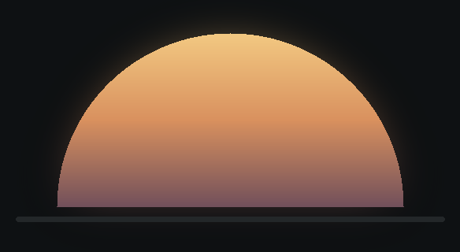
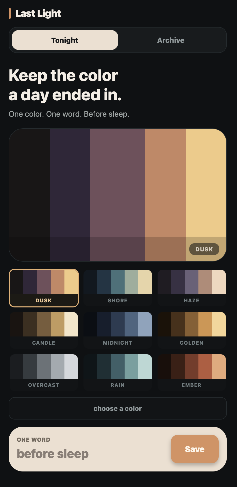
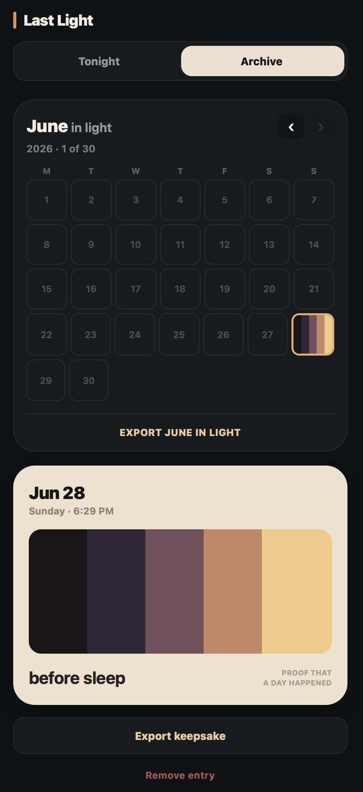

<p align="center">
  
</p>

<h1 align="center">Last Light</h1>

<p align="center">
  Keep the color a day ended in.
</p>

<p align="center">
  Last Light is a quiet Expo app for saving one palette and one word before sleep.<br />
  Entries stay on the device, build into a monthly archive, and can be exported as keepsake images.
</p>

<div align="center">
<table>
  <tr>
    <td align="center">
      
    </td>
    <td align="center">
      
    </td>
  </tr>
  <tr>
    <td align="center">Tonight</td>
    <td align="center">Archive</td>
  </tr>
</table>
</div>

## What It Does

- Save a daily palette with one short word.
- Browse saved days in a calendar archive.
- Export a day card or monthly light grid.
- Store entries locally with AsyncStorage.

## Built With

- Expo
- React Native
- TypeScript

## Run Locally

Install dependencies:

```sh
npm install
```

Start the development server:

```sh
npm start
```

Run on a target platform:

```sh
npm run ios
npm run android
npm run web
```

## License

[MIT](LICENSE)
